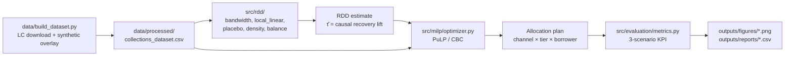

# Constrained Collections Allocation and Causal Recovery Optimization Platform

> Operational debt-collection allocation combining **Regression Discontinuity
> Design (RDD)** for causal recovery lift measurement with **Mixed-Integer
> Linear Programming (MILP)** for resource-constrained outreach optimization.

[](https://github.com/404Piyush/collections-causal-allocation/actions/workflows/ci.yml)
[](./LICENSE)
[](https://www.python.org/downloads/)
[](https://github.com/psf/black)
[](https://github.com/astral-sh/ruff)
[](https://github.com/PyCQA/bandit)
[](./pyproject.toml)
[](./CITATION.cff)

---

## Table of contents

- [Why this project](#why-this-project)
- [Features](#features)
- [Quickstart](#quickstart)
- [Architecture](#architecture)
- [Project structure](#project-structure)
- [Methodology](#methodology)
- [Results](#results)
- [Configuration](#configuration)
- [Development](#development)
- [Documentation](#documentation)
- [Roadmap](#roadmap)
- [Citation](#citation)
- [Contributing](#contributing)
- [License](#license)

---

## Why this project

Retail-finance lenders run tiered collection campaigns — automated dials
(Level 0) and human-agent outreach (Level 1). Level 1 costs ~$50 more per
account than Level 0 but yields higher recovery. The central operational
question is:

> *Which accounts truly benefit from human outreach, and how do we allocate
> a limited budget and finite agent capacity to maximize net recovery?*

This project answers it in two stages:

1. **Causal verification (RDD):** exploit the operational cutoff at
   `expected_recovery_score = 1000` to measure the unbiased marginal
   recovery lift of human outreach.
2. **Optimal allocation (MILP):** given a finite budget and agent
   capacities, maximize net recovery while respecting every operational
   constraint.

**Headline numbers (synthetic dataset, 8,000 accounts):**

| Scenario                | Cost    | Net recovery | vs current |
|-------------------------|---------|--------------|------------|
| All Level 0 (auto only) | $12K    | $19.32M      | -13.5%     |
| All Level 1 (current)   | $412K   | $22.34M      | 0%         |
| **MILP-optimized**      | **$8K** | **$22.43M**  | **+0.4%**  |

The MILP recovers roughly the same amount of money as current practice at
**~2% of the cost**.

---

## Features

- **Causal inference**
  - Imbens-Kalyanaraman optimal bandwidth selector with a Silverman fallback
  - Local linear regression with a triangular kernel
  - Placebo-cutoff tests across 7 fake cutoffs
  - McCrary-style density / manipulation test
  - Covariate-balance check at the cutoff
  - Sensitivity to bandwidth multipliers (0.5x → 2.0x)
- **Operations research**
  - Mixed-Integer Linear Programming with binary decision variables
  - Constraints: one assignment per account, total budget, per-tier
    agent-hour capacity
  - Default solver: **CBC** via **PuLP** (no commercial license needed)
  - Sensitivity sweep over 18 budget × capacity combinations
- **Engineering**
  - Strict typing, modular subpackages, 100-char black formatting
  - 9+ unit tests, bandit security audit (clean), pytest coverage gate ≥ 60%
  - GitHub Actions CI on Python 3.11 + 3.12 with lint / type / security / test
    / notebook-execution jobs
  - `pyproject.toml` packaging, `Makefile` task runner, `pre-commit` hooks
  - `Dockerfile` + `docker-compose.yml` for fully reproducible runs

---

## Quickstart

### Option A — local (recommended)

```bash
git clone https://github.com/404Piyush/collections-causal-allocation.git
cd collections-causal-allocation
make install-dev          # runtime + dev dependencies
make pipeline             # full pipeline (~8 min)
make test                 # run unit tests
```

### Option B — Docker

```bash
docker compose up pipeline           # run full pipeline in container
docker compose --profile notebook up notebook
                                   # launch Jupyter at http://localhost:8888
```

### Option C — minimal

```bash
pip install -r requirements.lock
python run_pipeline.py
```

After running, explore:

- `outputs/figures/*.png` — 10 generated figures
- `outputs/reports/*.csv` — 6 KPI tables
- `notebooks/demo.ipynb` — interactive walkthrough of all 8,000 borrowers

---

## Architecture



See [`docs/ADR-0001-rdd-milp-choice.md`](./docs/ADR-0001-rdd-milp-choice.md)
for the rationale.

---

## Project structure

```
collections-optimization/
├── README.md
├── LICENSE                          MIT license
├── CHANGELOG.md                     version history
├── CONTRIBUTING.md                  how to contribute
├── CODE_OF_CONDUCT.md               Contributor Covenant v2.1
├── SECURITY.md                      responsible disclosure
├── CITATION.cff                     machine-readable citation
├── pyproject.toml                   packaging + tool config
├── Makefile                         task runner
├── Dockerfile + docker-compose.yml  reproducible containers
├── .editorconfig
├── .pre-commit-config.yaml          pre-commit hooks
├── .github/
│   ├── workflows/ci.yml             CI: lint / type / security / test / notebook
│   ├── ISSUE_TEMPLATE/              bug + feature templates
│   └── PULL_REQUEST_TEMPLATE.md
├── docs/
│   ├── resume_blueprint.md
│   ├── security_audit.md
│   ├── ADR-0001-rdd-milp-choice.md  architecture decision record
│   └── references.md                academic bibliography
├── data/
│   ├── build_dataset.py             LC download + synthetic overlay
│   └── raw/, processed/             gitignored (regenerable)
├── src/
│   ├── __init__.py                  exposes __version__
│   ├── config.py                    constants (cutoff, costs, capacity)
│   ├── data_loader.py
│   ├── rdd/                         bandwidth, local_linear, placebo, density, balance
│   ├── milp/                        optimizer, sensitivity
│   ├── evaluation/                  metrics (3-scenario KPI)
│   └── viz/                         rdd_plots, milp_plots, kpi_plots
├── tests/                           9 unit tests (data_loader, milp, rdd)
├── notebooks/
│   ├── demo.ipynb                   full 8000-borrower walkthrough
│   └── _build.py                    source-of-truth generator
└── outputs/
    ├── figures/                     gitignored (regenerable)
    └── reports/                     gitignored (regenerable)
```

---

## Methodology

### RDD — local linear regression at the cutoff

Accounts crossing the operational threshold `c = 1000` receive Level 1
outreach. We fit a local-linear regression with a triangular kernel and
separate MSE-optimal bandwidths on each side of the cutoff:

```
Y_i = β_0 + β_1 (R_i − c) + τ T_i + β_3 (R_i − c) T_i + ε_i
K(R_i, c, h) = max(0, 1 − |R_i − c| / h)
```

`τ̂` is the **causal recovery lift** of human outreach (Local Average
Treatment Effect at the cutoff). Bandwidth is selected via Imbens-Kalyanaraman
with a Silverman fallback; robustness is checked against (a) a bandwidth
multiplier grid, (b) placebo cutoffs, (c) a density / manipulation test, and
(d) covariate-balance tests.

### MILP — binary allocation under budget and capacity

Decision variables: `x[i, j, k] ∈ {0, 1}` (account `i` routed to channel
`j` with agent tier `k`).

```
max   Σᵢ Σⱼ Σₖ (P_ijk · Bal_i − C_jk) · x_ijk
s.t.  Σⱼ Σₖ x_ijk ≤ 1                          ∀ i         (one assignment)
      Σᵢ Σⱼ Σₖ C_jk · x_ijk ≤ Budget                     (budget cap)
      Σᵢ Σⱼ Time_j · x_ijk ≤ Cap_k · 60        ∀ k         (agent hours)
```

Solver: `PULP_CBC_CMD` (open-source, MIT-compatible).

See [`docs/ADR-0001-rdd-milp-choice.md`](./docs/ADR-0001-rdd-milp-choice.md)
for the design rationale and [`docs/references.md`](./docs/references.md)
for academic citations.

---

## Results

A single run of `make pipeline` produces:

- `outputs/figures/rdd_regression_discontinuity.png` — RDD scatter + local-linear fit
- `outputs/figures/rdd_placebo_cutoffs.png` — placebo test
- `outputs/figures/rdd_density_test.png` — McCrary density
- `outputs/figures/rdd_covariate_balance.png` — covariate balance
- `outputs/figures/rdd_bandwidth_sensitivity.png` — sensitivity grid
- `outputs/figures/milp_allocation_distribution.png` — channel × tier counts
- `outputs/figures/milp_sensitivity_heatmap.png` — budget × capacity sweep
- `outputs/figures/kpi_scenario_comparison.png` — 3-scenario bar chart
- `outputs/figures/kpi_cost_waterfall.png` — cost waterfall
- `outputs/figures/kpi_per_quintile_roi.png` — quintile ROI

And CSV reports:

- `rdd_results.csv`, `rdd_placebo.csv`, `rdd_covariate_balance.csv`
- `milp_assignments.csv`, `milp_sensitivity.csv`
- `scenario_comparison.csv`

---

## Configuration

All knobs live in [`src/config.py`](./src/config.py):

| Constant                  | Meaning                          | Default     |
|---------------------------|----------------------------------|-------------|
| `CUTOFF`                  | RDD running-variable threshold   | `1000.0`    |
| `RANDOM_SEED`             | Reproducibility seed             | `20260521`  |
| `TOTAL_BUDGET`            | MILP global budget (USD)         | `25000.0`   |
| `CHANNELS`                | Outreach channels                | SMS, Email, Phone, FieldVisit |
| `AGENT_TIERS`             | Agent seniority tiers            | Junior, Senior, Specialist |
| `COST_MATRIX`             | Per (channel, tier) cost (USD)   | see file    |
| `TIME_MINUTES`            | Per-channel handling time (min)  | see file    |
| `AGENT_CAPACITY_HOURS`    | Tier-specific capacity (hours)   | see file    |
| `RDD_BANDWIDTH_GRID`      | Bandwidth multipliers for sensitivity | 0.5×–2.0× |
| `PLACEBO_CUTOFFS`         | Fake cutoffs for placebo test    | see file    |

---

## Development

```bash
make install-dev     # install runtime + dev tools
make pre-commit      # install git pre-commit hooks
make format          # auto-format (black + isort + ruff --fix)
make lint            # check formatting + ruff
make type-check      # mypy
make security        # bandit
make test            # pytest with coverage gate (≥ 60%)
make audit           # lint + type-check + security + test (what CI runs)
make pipeline        # run full end-to-end pipeline
make notebook        # rebuild + execute the demo notebook
make clean           # remove generated artifacts and caches
```

All targets are self-documenting — run `make help`.

---

## Documentation

- [`docs/ADR-0001-rdd-milp-choice.md`](./docs/ADR-0001-rdd-milp-choice.md) — why RDD + MILP
- [`docs/references.md`](./docs/references.md) — academic bibliography
- [`docs/security_audit.md`](./docs/security_audit.md) — full bandit report
- [`docs/resume_blueprint.md`](./docs/resume_blueprint.md) — project framing
- [`notebooks/demo.ipynb`](./notebooks/demo.ipynb) — interactive walkthrough
- [`CHANGELOG.md`](./CHANGELOG.md) — release notes
- [`CONTRIBUTING.md`](./CONTRIBUTING.md) — dev workflow
- [`SECURITY.md`](./SECURITY.md) — responsible disclosure

---

## Roadmap

- [ ] Replace synthetic dataset with real lender extract (LC + internal)
- [ ] Cross-validated bandwidth selection (currently IK)
- [ ] Fuzzy-RDD sensitivity check at the cutoff
- [ ] Stochastic MILP with recourse for uncertain `P_ijk`
- [ ] Streamlit UI for parameter tuning (optional, see [#1][#1])
- [ ] GitHub Pages site via MkDocs (optional)
- [ ] Dependabot config + automated dependency PRs

[#1]: https://github.com/404Piyush/collections-causal-allocation/issues

---

## Citation

If you use this work in research, please cite via the **"Cite this
repository"** button on GitHub or copy from
[`CITATION.cff`](./CITATION.cff).

```bibtex
@software{utkar2026collections,
  author = {Utkar, Piyush},
  title = {Constrained Collections Allocation and Causal Recovery Optimization Platform},
  version = {0.2.0},
  year = {2026},
  url = {https://github.com/404Piyush/collections-causal-allocation}
}
```

---

## Contributing

Contributions are welcome — see [`CONTRIBUTING.md`](./CONTRIBUTING.md) for
the workflow and [`CODE_OF_CONDUCT.md`](./CODE_OF_CONDUCT.md) for community
standards. Bug reports and feature requests go through
[GitHub Issues](https://github.com/404Piyush/collections-causal-allocation/issues).

---

## License

[MIT](./LICENSE) — © 2026 Piyush Utkar.